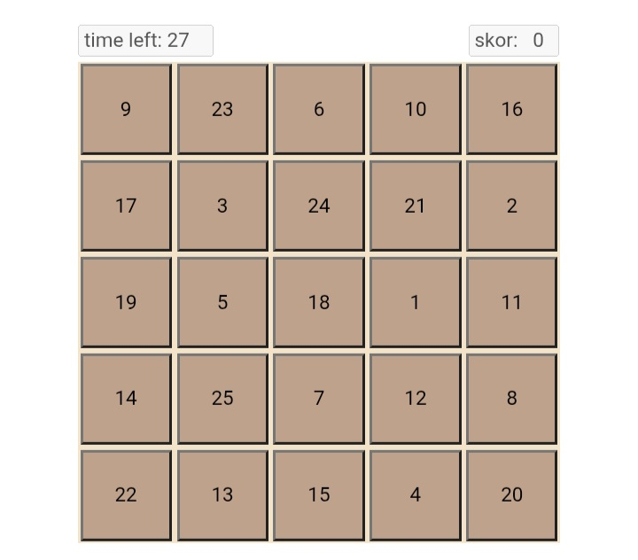

# Game Urut Angka

Game sederhana berbasis HTML, CSS, dan JavaScript.
Pemain harus menekan angka dari 1 sampai 25 secara berurutan sebelum waktu habis.

## Fitur
- Random angka
- Timer
- Skor
- Dialog tutorial
- Warna benar / salah
- Grid layout

## Teknologi
- HTML
- CSS
- JavaScript

## Cara menjalankan
Buka file index.html di browser.

## Screenshot

### noted
README.md ini dibuat oleh ChatGPT, tetapi project ini tetap dibuat oleh saya, karena itu mohon maaf atas kekurangan dari project ini...